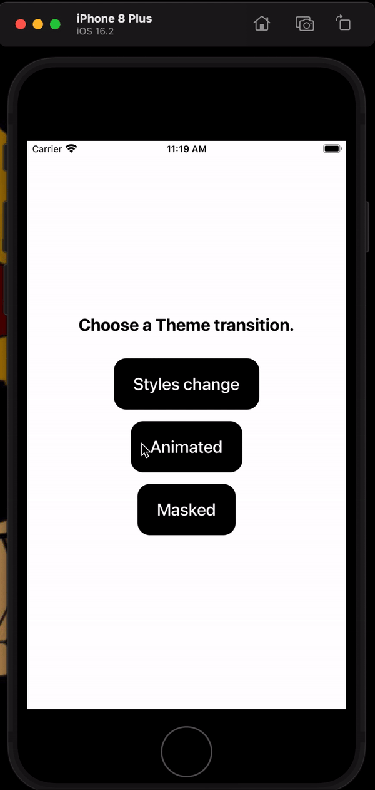
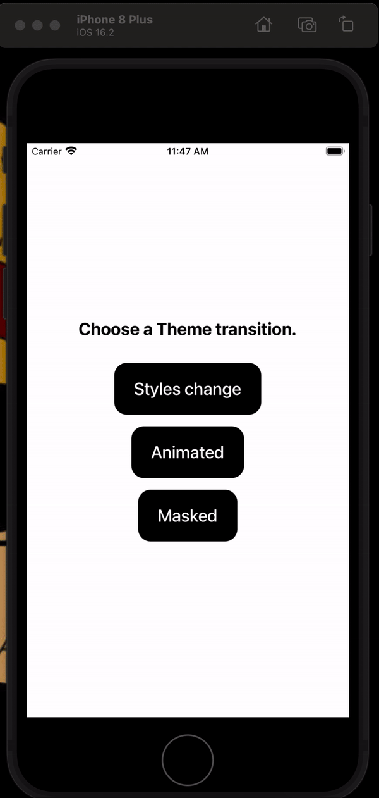

# React Native Demo App: Light/Dark Mode with Animation

This React Native demo app showcases Light/Dark mode with animation using @shopify/react-native-skia and Reanimated. It includes three modes of transitions:

- Dynamic style change on state change



- Animated transition using Reanimated


- Masking with the help of Skia



## Features

- Light/Dark mode theme transition with animation
- Smooth transition effects
- Utilizes Reanimated and Skia for animations

## Requirements

- Node.js
- npm or yarn
- React Native development environment set up

## Installation

1. Clone the repository:

   ```bash
   git clone https://github.com/PrayagJoshi10/LightDarkRN.git
   ```

2. Navigate to the project directory:

   ```bash
   cd react-native-custom-drawer
   ```

3. Install dependencies using yarn:

   ```bash
   yarn install
   ```

## Usage

1. Start the Metro bundler:

   ```bash
   npx react-native start
   ```

2. Run the application on a connected emulator or device:

   ```bash
   npx react-native run-android
   # or
   npx react-native run-ios
   ```

3. Explore the Light/Dark mode theme transition and animations in the demo app.

## Dependencies

- React Navigation: For managing navigation in the React Native app.
- Reanimated: For creating smooth and interactive animations.
- React Native Skia: For masking and animations.

## Author

Prayag Joshi
